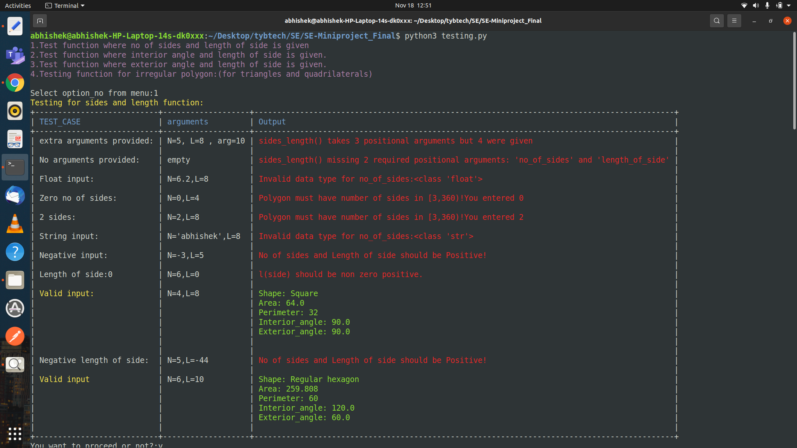

<h1 align="center">
	SE-Miniproject
</h1>

<h3 align="center">
  Polygon_features(Area,shape prediction)calculator
</h3>
<p align="center">
  

  <a>
    	  
	  
  </a>

  
</p>

<p align="center">
  <a href="#-about-the-project">About the project</a>&nbsp;&nbsp;&nbsp;|&nbsp;&nbsp;&nbsp;
  <a href="#-features">Features</a>&nbsp;&nbsp;&nbsp;|&nbsp;&nbsp;&nbsp;
  <a href="#-getting-started">Getting started</a>&nbsp;&nbsp;&nbsp;|&nbsp;&nbsp;&nbsp;
  <a href="#-built-with">Built with</a>&nbsp;&nbsp;&nbsp;|&nbsp;&nbsp;&nbsp;
  <a href="#-acknowledgements">Acknowledgements</a>&nbsp;&nbsp;&nbsp;|&nbsp;&nbsp;&nbsp;
</p>



### 👨🏻‍💻 About The Project
This is a testing tool for the Polygon Calculator. 

## 🌟 Features

-   It predicts the shape of the polygon based on **no of sides**, **interior angle** and **exterior angle** provided by the **User**. 
-   It show the features of respective polygon namely: **Area**, **Perimeter**, **Interior angle**, **Exterior angle**.


## 💻 Getting Started

#### Prerequisites:

1. Python3
2. Linux or Windows or Macos

#### Installing:

1. Install all the required dependencies:
    ```sh
    pip install prettytable
    ```

#### Usage:
1. Type in the terminal:
    ```sh
    python3 testing.py
    ```
    

## 🚀 Built With
1. Prettytable : a Python library for generating simple ASCII tables.
2. python3


## 📝 Acknowledgements

1. Pretty Table tutorial: (https://ptable.readthedocs.io/en/latest/tutorial.html)
